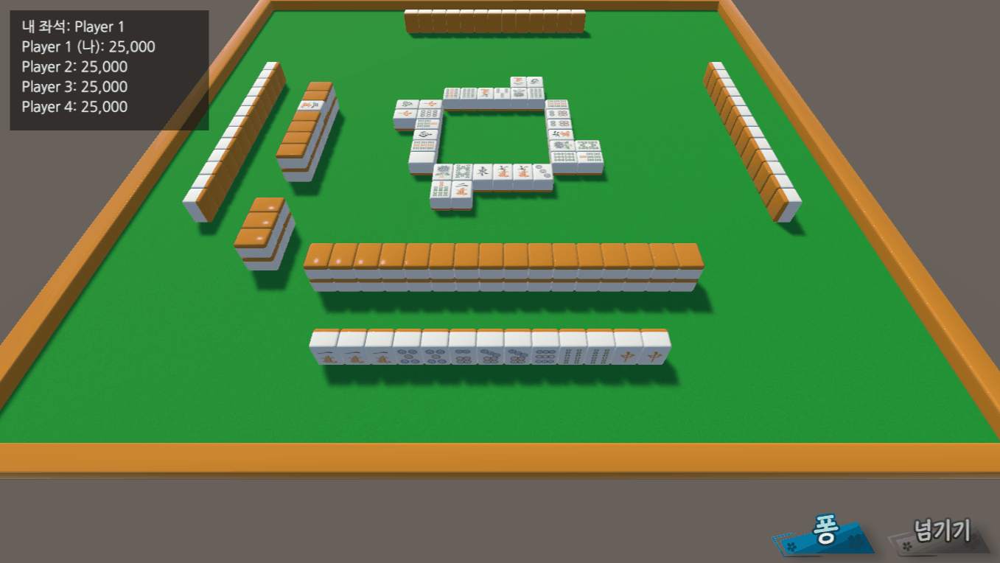
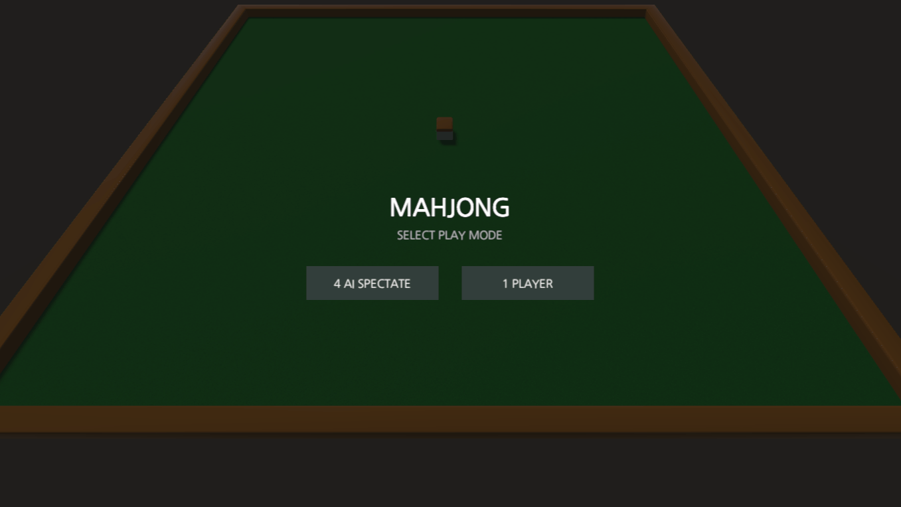

# Mahjong One-Round Simulator — Portfolio

JavaScript로 작성된 Kobalab의 오픈소스 리치 마작 코어와 휴리스틱 AI를 C#으로 포팅·개량하고, Unity의 3D 마작패 표현과 한 국 진행 시스템에 통합한 개인 프로젝트입니다.

단순한 패 조합 계산에 그치지 않고 `패산 구성 → 배패 → 쯔모 → 행동 선택 → 타패 → 타가의 론·후로 판단 → 점수 정산` 흐름을 실제 게임 상태로 연결했습니다. 시작 화면에서 4-AI 자동 대국 관전과 1인 직접 플레이를 선택할 수 있습니다.

## 프로젝트 정보

| 항목 | 내용 |
| --- | --- |
| 개발 기간 | 2024.02–2024.06 |
| 개발 형태 | 개인 프로젝트 |
| 결과 | 한 국 진행, 4-AI 자동 대국 관전, 1인 직접 플레이 프로토타입 |
| 기술 | Unity, C#, DOTween |
| 실행 방식 | 시작 화면에서 `4 AI SPECTATE` 또는 `1 PLAYER` 선택 |

## 플레이

- [WebGL 버전 실행](https://jun-uni.github.io/Mahjong-Simulator/)

### 1인 직접 플레이

Player 1의 손패를 직접 조작하고, 가능한 치·퐁·깡·리치·론·쯔모를 선택합니다.



### 4-AI 자동 대국 관전

네 좌석의 휴리스틱 AI가 한 국을 자동으로 진행하는 과정을 관전합니다.



## 규칙 기준과 참고 자료

국 진행 규칙은 Kobalab의 [전뇌마작 규칙 설정](https://kobalab.net/majiang/rule.html)과 `majiang-core` 구현을 기준으로 옮기고, [천봉 4인 마작 공식 규칙](https://tenhou.net/man/)도 함께 참고했습니다.

이 프로젝트는 전뇌마작과 천봉에서 공통으로 확인할 수 있는 한 국 내부의 행동 규칙을 구현 대상으로 삼았습니다. 치·퐁·깡, 리치, 후리텐, 론·쯔모와 점수 정산은 반영했지만 동풍전·반장전 전체 운영, 연장전과 최종 순위 규칙은 구현 범위에 포함하지 않았습니다.

## 구현 범위

- 136장 패 생성, 셔플, 패산·왕패 구성과 배패
- 쯔모, 타패, 행동 대기와 턴 전환
- 치, 퐁, 대명깡, 안깡, 소명깡과 후로 패의 3D 배치
- 영상패 쯔모, 깡도라 공개와 깡 직후 화료 상태 전달
- 리치, 더블 리치, 일발, 1,000점 공탁과 리치 선언패 표시
- 자신의 버림패와 론 넘김을 반영한 후리텐 처리
- 론, 쯔모, 복수 론 후보와 타가 행동 우선순위 해결
- 샹텐, 유효패, 남은 패 수, 위험도와 화료 점수를 사용한 AI 평가
- 외부 C# 점수 라이브러리를 통한 역·부·점수 판정
- 사용자 행동 버튼, 현재 점수 HUD와 화료 결과 패널

## 전체 구조

```text
GameSetter
  └─ 패 생성 → 셔플 → 패산·왕패 구성 → 배패
          ↓
MahjongManager
  └─ 쯔모 → 행동 후보 수집 → 타패 → 론·후로 해결 → 점수 정산
          ├─ MahjongPlayer: 좌석별 손패·버림패·후로 오브젝트
          ├─ MahjongAI: 타패·후로·깡·리치·화료 후보 선택
          ├─ HandTile: 손패·쯔모패·후로와 리치 상태
          ├─ TileCalculator: 남은 패와 상대별 위험도 추적
          └─ MahjongScorerAdapter: 내부 게임 상태를 점수 라이브러리 입력으로 변환
```

국 진행과 시각 연출은 Unity에서 작성했습니다. 손패 표현과 AI의 판단 흐름은 Kobalab 오픈소스를 C#으로 포팅한 뒤 Unity용 데이터 구조와 상태 진행 방식에 맞춰 통합했습니다.

## 상태 기반 국 진행

국 진행을 상태로 나누고, 상태가 바뀐 직후에만 해당 로직을 시작하도록 구성했습니다. 패 이동은 DOTween 완료 콜백에서 다음 상태로 연결해 규칙 계산과 3D 연출의 순서를 맞췄습니다.

```csharp
private void Update()
{
    switch (currentGameState)
    {
        case GameState.Tsumo:
            ExecuteOnlyOnce(DealTile);
            break;
        case GameState.WaitForActionAfterZimo:
            ExecuteOnlyOnce(AttemptActionAfterZimo);
            break;
        case GameState.WaitForActionAfterDiscard:
            ExecuteOnlyOnce(AttemptActionAfterDiscard);
            break;
        case GameState.Discard:
            ExecuteOnlyOnce(DiscardTile, false);
            break;
    }
}

private void ChangeState(GameState newState)
{
    currentGameState = newState;
    isStateInitialized = false;
}
```

```csharp
private void ExecuteOnlyOnce(Action action)
{
    if (isStateInitialized)
        return;

    isStateInitialized = true;
    action();
}
```

## 규칙과 행동 해결

| 시점 | 판단과 처리 |
| --- | --- |
| 쯔모&nbsp;직후 | 쯔모 화료, 안깡·소명깡, 리치 가능성을 먼저 판정한 뒤 타패 진행 |
| 타패&nbsp;직후 | 모든 좌석의 론 후보를 수집하고, 론이 없을 때 퐁·대명깡과 치를 처리 |
| 동시&nbsp;행동 | `론 → 퐁·대명깡 → 치` 우선순위 적용. 복수 론은 모두 정산하고, 퐁·대명깡 후보는 버린 좌석에서 가까운 순서로 결정 |
| 리치 | 멘젠·점수·남은 패 수·텐파이 유지 여부 확인, 1,000점 공탁, 선언 뒤 쯔모기리 제한 |
| 후리텐 | 자신의 버림패가 대기패에 포함되는지 검사하고, 화료 가능한 타패를 넘기면 임시 후리텐 설정 |
| 깡 | 타패 반응의 대명깡과 쯔모 뒤의 안깡·소명깡을 분리하고, 영상패 쯔모와 추가 도라 공개로 연결 |
| 화료 | 론과 쯔모를 구분하고 외부 계산 결과에 따라 친·자 점수 이동과 공탁금을 정산 |

### 타패 뒤의 행동 후보 수집

각 좌석의 론과 후로 가능성을 먼저 수집한 뒤 하나의 해결 단계에서 우선순위를 적용했습니다. 사용자 좌석에는 가능한 행동만 버튼으로 표시하고, 4-AI 모드에서는 같은 후보를 AI가 선택합니다.

```csharp
PointInfo ronAction = player.mahjongAI.SelectWin(discardTile);
if (ronAction != null)
    pendingRonActions.Add((playerIndex, ronAction));

string call = player.mahjongAI.SelectHuro(
    discardTile,
    discardPlayerState,
    null);

if (MahjongUtility.IsHuroChi(call))
    pendingChiActions.Add(playerIndex, call);
else if (!string.IsNullOrEmpty(call))
    pendingPongAndKkangActions.Add(playerIndex, call);
```

완성된 패 모양이라도 실제 역이 없어 점수가 생성되지 않으면 화료 후보에서 제외합니다. 해결 단계에서도 `Ron` 점수와 양수 득점이 확인된 후보만 남깁니다. 론 후보가 있으면 후로보다 먼저 정산하고, 론이 없을 때 퐁·대명깡을 치보다 먼저 처리합니다. 복수 론은 버린 좌석으로부터의 순서대로 정렬해 각 승자의 점수를 반영합니다.

```csharp
ronActions = ronActions
    .Where(action => action.Item2 is Ron ron && ron.BaseGain > 0)
    .ToList();

if (ronActions.Count > 0)
{
    List<(int, PointInfo)> orderedRonActions = ronActions
        .OrderBy(action => GetTurnDistance(action.Item1))
        .ToList();

    for (int index = 0; index < orderedRonActions.Count; index++)
    {
        int playerIndex = orderedRonActions[index].Item1;
        if (orderedRonActions[index].Item2 is Ron point)
            WinRon((PlayerState)playerIndex, point, index == 0);
    }
    return;
}
else if (pongAndKkangActions.Count > 0)
{
    int playerIndex = pongAndKkangActions.Keys
        .OrderBy(GetTurnDistance)
        .First();
    HuroTile((PlayerState)playerIndex, pongAndKkangActions[playerIndex]);
}
else if (chiActions.Count > 0)
{
    int playerIndex = chiActions.Keys
        .OrderBy(GetTurnDistance)
        .First();
    HuroTile((PlayerState)playerIndex, chiActions[playerIndex]);
}
```

### 리치와 후리텐

리치는 이미 리치한 손패, 비멘젠, 1,000점 미만, 남은 패 부족과 비텐파이 상태를 차단합니다. 선언할 타패를 가상으로 제거한 뒤 샹텐이 0이고 대기패가 존재할 때만 선택을 허용합니다.

```csharp
HandTile nextHand = handTile.Clone().Discard(tileString);
return Shanten.GetShanten(nextHand) == 0
       && Shanten.GetWaitingTiles(nextHand).Count > 0;
```

선언 뒤에는 쯔모기리만 허용하고 리치봉 1,000점을 공탁합니다. 선언패가 치·퐁·대명깡으로 가져가진 경우에는 해당 표시를 해제하고 다음 버림패를 가로로 배치해 리치 선언 위치가 사라지지 않도록 처리했습니다.

후리텐은 텐파이 손패의 대기패와 자신의 버림패를 비교해 판정합니다. 또한 화료 가능한 타패를 론하지 않고 넘긴 경우 후리텐 상태를 설정하며, 비리치 플레이어의 임시 후리텐은 자신의 다음 타패 판단 주기에서 해제한 뒤 버림패 후리텐을 다시 계산합니다.

```csharp
public static bool CheckFuriten(MahjongPlayer player)
{
    if (Shanten.GetShanten(player.mahjongAI.handTile) != 0)
        return false;

    List<string> waitingTiles =
        Shanten.GetWaitingTiles(player.mahjongAI.handTile);

    return waitingTiles.Any(tile =>
        player.discardTilesData.Contains(tile));
}
```

사용자가 화료 가능한 버림패를 넘긴 경우에도 같은 상태로 연결했습니다.

```csharp
if (pendingUserActionWindow == UserActionWindow.AfterDiscard)
{
    if (pendingUserWinAction != null)
        mahjongPlayers[(int)userPosition].mahjongAI.Furiten = true;

    ResolveDiscardActions(
        pendingPongAndKkangActions,
        pendingChiActions,
        pendingRonActions);
}
```

### 세 종류의 깡과 도라 진행

- `대명깡`: 타가의 버림패에 반응하는 후로 후보로 수집
- `안깡`: 같은 패 네 장을 손패에서 분리해 별도 배치
- `소명깡`: 기존 퐁 몸통을 찾아 네 번째 패를 추가

깡 종류에 따라 손패와 후로 데이터를 다르게 갱신하고, 패 오브젝트의 위치와 회전을 좌석별로 계산했습니다. 처리 완료 뒤에는 추가 도라를 공개하고 왕패에서 영상패를 쯔모하도록 상태를 연결했습니다.

```csharp
private void ExecuteSelfKkang(string kkangString)
{
    CloseUserActionWindow();
    Sequence kkang = KkangTile(kkangString);

    kkang.OnComplete(() =>
    {
        Sequence sort = mahjongPlayers[(int)currentPlayerTurn]
            .SortHandTiles();

        sort.OnComplete(() =>
        {
            Sequence revealDora = RevealDoraIndicator();
            revealDora.OnComplete(() =>
                ChangeState(GameState.DeadWallDraw));
        });
    });
}
```

영상패를 받은 직후에는 `AfterKan` 상태를 점수 계산 설정에 전달해 영상개화 판정과 이어지도록 했습니다.

```csharp
mahjongPlayers[(int)currentPlayerTurn]
    .mahjongAI.handConfig.AfterKan = true;

sequence.OnComplete(() =>
{
    Sequence replace = ReplaceDeadWallAfterKkang();
    replace.OnComplete(() =>
        ChangeState(GameState.WaitForActionAfterZimo));
});
```

## JavaScript에서 C#으로 옮긴 판단 흐름

Kobalab `majiang-ai`의 원본은 후보 타패마다 손패를 복제하고 평가하는 JavaScript 흐름을 사용합니다.

```javascript
for (let p of this.get_dapai(this.shoupai)) {
    let shoupai = this.shoupai.clone().dapai(p);
    let ev = this.eval_shoupai(shoupai, paishu);
}
```

출처: [Kobalab majiang-ai `player.js`](https://github.com/kobalab/majiang-ai/blob/master/lib/player.js) — MIT License

이를 C#의 명시적 타입과 프로젝트 데이터 모델에 맞춰 다음과 같이 옮겼습니다.

```csharp
foreach (string tileString in handTile.GetDiscardList())
{
    HandTile nextHand = handTile.Clone().Discard(tileString);
    float value = EvaluateHandTile(nextHand, tileArray, backtrack);

    if (value > resultValue)
        resultValue = value;
}
```

단순한 문법 변환이 아니라 다음 경계를 다시 구성했습니다.

- JavaScript 손패 객체 → C# `HandTile`
- 가상 타패·쯔모와 남은 패 → `Clone`, `Discard`, `Tsumo`, `TileArray`
- 재귀 평가 → 손패 문자열 키를 사용한 평가 캐시
- AI의 선택 결과 → Unity의 쯔모·타패·후로 상태와 DOTween 완료 콜백
- 완성 패 평가 → 외부 점수 라이브러리의 `PointInfo`를 휴리스틱 값으로 사용

## 외부 점수 계산 라이브러리 연동

국 진행 엔진은 언제 치·퐁·깡·리치·론·쯔모가 가능한지와 어떤 행동을 먼저 해결할지를 담당합니다. 완성된 손패가 실제 역을 가지고 있는지, 몇 판·몇 부인지와 친·자별 지불 점수는 `donaldnevermore Mahjong Scorer`에 위임했습니다.

`MahjongScorerAdapter`는 다음 데이터를 변환해 계산기에 전달합니다.

- 손패와 화료패
- 치·퐁·대명깡·소명깡은 공개 멘츠, 안깡은 폐쇄 멘츠로 구분한 패 문자열
- 공개된 도라 표시패
- 론·쯔모, 리치·더블 리치·일발과 영상개화 여부
- 장풍, 자풍, 본장과 리치 공탁금

```csharp
public static PointInfo GetScoreByHandTile(
    HandTile handTile,
    HandConfig handConfig,
    RoundConfig roundConfig)
{
    RuleConfig rule = new RuleConfig();
    HandInfo hand = ConvertHandTileToScorerHand(
        handTile,
        handConfig.Riichi != RiichiStatus.None);
    return Scorer.GetScore(hand, handConfig, roundConfig, rule);
}
```

라이브러리의 45개 `YakuType`에는 리치, 핑후, 탕야오, 역패, 일발, 치또이츠, 또이또이, 삼색동순, 일기통관, 혼일색, 청일색과 국사무쌍·사암각·대삼원 등 여러 역만이 포함됩니다. 판정 결과의 판·부·기본 점수를 게임의 론·쯔모 정산과 결과 UI에 연결했습니다.

## 관전 모드와 사용자 조작

게임 시작 전에 실행 모드를 선택합니다.

```csharp
public void StartFourAiMode() => StartSelectedMode(true);
public void StartSinglePlayerMode() => StartSelectedMode(false);

private void StartSelectedMode(bool useFourAiMode)
{
    if (hasGameStarted)
        return;

    hasGameStarted = true;
    fourAiMode = useFourAiMode;
    playerPosition = PlayerState.Player1;
    SetUserPosition();
    uiManager.HideModeSelection();
    StartMahjongGame();
}
```

4-AI 모드에서는 사용자 행동 UI 없이 네 AI의 선택을 관전합니다. 1인 모드에서는 Player 1의 손패를 공개하고, 패를 선택해 타패하거나 가능한 치·퐁·깡·리치·론·쯔모와 넘김을 버튼으로 결정합니다.

화면에는 네 좌석의 현재 점수와 사용자 좌석을 표시합니다. 화료 후에는 승자, 론·쯔모 구분, 획득 점수, 판·부와 정산 후 점수를 결과 패널로 확인할 수 있습니다.

## 구현 상태

- 한 국 단위의 패산 구성과 종료까지 진행 가능
- 4-AI 자동 대국 관전과 Player 1 직접 조작 지원
- 치·퐁·세 종류의 깡·리치·론·쯔모 입력과 AI 판단 지원
- 현재 점수 HUD와 화료 결과 패널 지원
- 화료 또는 패산 소진 뒤 장면을 다시 불러와 새 국 시작
- 연속된 동장·남장 운영과 최종 순위 계산은 미구현

## 참고한 오픈소스

- [Kobalab majiang-core](https://github.com/kobalab/majiang-core) — MIT License
- [Kobalab majiang-ai](https://github.com/kobalab/majiang-ai) — MIT License
- `donaldnevermore Mahjong Scorer` — Apache License 2.0

제가 직접 구현한 범위는 C#으로 포팅한 마작 데이터 구조와 AI의 개량·통합, 패산·배패·턴 진행, 행동 후보 수집과 우선순위 해결, 사용자 행동 UI, 3D 패 배치·연출, 점수 계산 어댑터와 정산 화면입니다.
